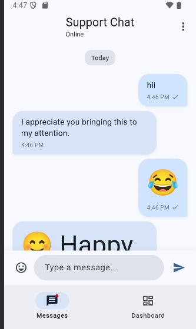

# 📱 HelpCenter - Messaging App + Internal Tools Dashboard

[](https://help-center-ieag.vercel.app/tickets)
[](https://flutter.dev)
[](https://angular.io)
[](https://tailwindcss.com)

A full-stack project combining a **Flutter mobile messaging app** with an **Angular-based internal tools dashboard**, embedded inside the app using WebView. The project demonstrates clean UI, local data persistence, responsive design, and seamless mobile–web integration.

---

## 🌐 Live Demo

**🔗 Angular Dashboard:** [https://help-center-ieag.vercel.app](https://help-center-ieag.vercel.app/tickets)

| Module | Link |
|--------|------|
| 🎫 Tickets | [View Tickets](https://help-center-ieag.vercel.app/tickets) |
| 📚 Knowledge Base | [View Knowledge Base](https://help-center-ieag.vercel.app/knowledgebase) |
| 📊 Live Logs | [View Logs](https://help-center-ieag.vercel.app/logs) |

---

## 📸 Screenshots


## Flutter Messaging App
<!-- Add your screenshots here -->
| Chat Screen | 
|-------------|
|  


---

## 🚀 Features

### 📱 Flutter Messaging App

| Feature | Description |
|---------|-------------|
| 💬 Chat Interface | Modern message bubbles with incoming/outgoing styles |
| 😊 Emoji Support | Quick emoji picker and emoji message type |
| 🤖 Auto-Reply | Simulated support agent responses |
| 💾 Persistence | Local message storage using Hive |
| 🔔 Badges | Unread message count indicator |
| 🕐 Smart Timestamps | Today, Yesterday, and date formatting |
| 🌙 Dark Mode | System-aware theme switching |
| ✨ Animations | Smooth scroll and UI transitions |
| 🌐 WebView | Embedded Angular dashboard |

### 🖥️ Angular Internal Tools Dashboard

| Feature | Description |
|---------|-------------|
| 🎫 Ticket Viewer | Filter by Open, In Progress, Closed status |
| 📚 Knowledge Base | Markdown editor with live preview |
| 📊 Live Logs | Real-time log streaming with pause/resume |
| 📱 Responsive | Mobile-first Tailwind CSS design |
| 🎨 Modern UI | Clean, professional interface |

---

## 🏗️ Tech Stack

### Mobile (Flutter)
```
Flutter 3.x | Dart (null-safe) | Hive | webview_flutter | intl
```

### Web (Angular)
```
Angular 16+ | TypeScript | Tailwind CSS | marked (Markdown)
```

---

## 📁 Project Structure

```
HelpCenter/
│
├── 📱 flutter_app/                    # Flutter Mobile App
│   ├── lib/
│   │   ├── main.dart                  # App entry point
│   │   ├── models/
│   │   │   └── message.dart           # Message data model
│   │   ├── screens/
│   │   │   ├── home_screen.dart       # Bottom navigation
│   │   │   ├── messages_screen.dart   # Chat interface
│   │   │   └── dashboard_screen.dart  # WebView container
│   │   ├── services/
│   │   │   └── message_service.dart   # Business logic
│   │   └── widgets/
│   │       └── message_bubble.dart    # Chat bubble widget
│   ├── android/
│   ├── ios/
│   └── pubspec.yaml
│
├── 🌐 webpage/                        # Angular Dashboard
│   ├── src/
│   │   ├── app/
│   │   │   ├── app.component.*        # Root component
│   │   │   ├── app.module.ts          # Module & routing
│   │   │   ├── tickets/               # Ticket management
│   │   │   ├── knowledgebase/         # Markdown editor
│   │   │   └── logs/                  # Live logs panel
│   │   ├── index.html
│   │   └── styles.css
│   ├── angular.json
│   └── package.json
│
└── README.md
```

---

## 🔧 Getting Started

### Prerequisites

- Flutter SDK 3.x+
- Node.js 18+
- Angular CLI (`npm install -g @angular/cli`)

---

### 1️⃣ Start the Angular Dashboard

```bash
cd webpage
npm install
ng serve --host 0.0.0.0
```

Dashboard available at:
| Platform | URL |
|----------|-----|
| Browser | `http://localhost:4200` |
| Android Emulator | `http://10.0.2.2:4200` |
| iOS Simulator | `http://localhost:4200` |

> ⚠️ Keep this terminal running

---

### 2️⃣ Start the Flutter App

Open a new terminal:

```bash
cd flutter_app
flutter pub get
flutter run
```

#### Useful Commands

```bash
# List connected devices
flutter devices

# Run on specific device
flutter run -d <device_id>

# Rebuild Hive adapters (if needed)
flutter pub run build_runner build --delete-conflicting-outputs
```

---

## 🧩 Architecture Overview

```
┌────────────────────────────────────────────────────────────────┐
│                        FLUTTER APP                             │
│                                                                │
│  ┌─────────────┐    ┌─────────────────┐    ┌───────────────┐   │
│  │   Screens   │◄──►│    Services     │◄──►│ Hive (Local)  │   │
│  │  (UI Layer) │    │ (Business Logic)│    │   (Storage)   │   │
│  └─────────────┘    └─────────────────┘    └───────────────┘   │
│         │                                                      │
│         ▼                                                      │
│  ┌────────────────────────────────────────────────────────┐    │
│  │                WebView (Dashboard Tab)                 │    │
│  │                                                        │    │
│  │  ┌───────────────────────────────────────────────────┐ │    │
│  │  │               ANGULAR DASHBOARD                   │ │    │
│  │  │                                                   │ │    │
│  │  │   ┌──────────┐  ┌──────────┐  ┌──────────┐        │ │    │
│  │  │   │ Tickets  │  │ KB Editor│  │   Logs   │        │ │    │
│  │  │   └──────────┘  └──────────┘  └──────────┘        │ │    │
│  │  │                                                   │ │    │
│  │  └───────────────────────────────────────────────────┘ │    │
│  │                                                        │    │
│  └────────────────────────────────────────────────────────┘    │
│                                                                │
└────────────────────────────────────────────────────────────────┘
```

---

## 🎯 Key Highlights

- ✅ **Real-time simulated chat** with auto-reply
- ✅ **Persistent message history** using Hive
- ✅ **Platform-aware WebView** (Android/iOS URL handling)
- ✅ **Responsive Angular dashboard** (works on mobile WebView)
- ✅ **Markdown editor** with live preview
- ✅ **Live logs** with pause/resume and export
- ✅ **Dark mode support** (system-aware)
- ✅ **Clean architecture** with separation of concerns

---

## 🧭 Roadmap

- [ ] Push notifications
- [ ] Backend integration for live messaging
- [ ] User authentication
- [ ] Cloud-synced dashboard data
- [ ] Production deployment guide
